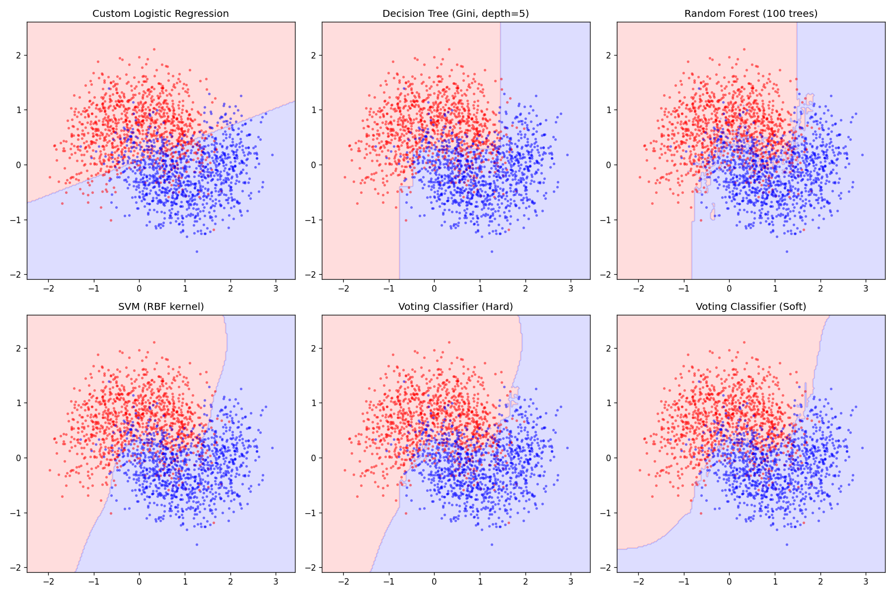

# Project 2 — Classification

Comparison of classification models on a `make_moons` dataset (10 000 samples, noise=0.4).



## Usage

```bash
python proj2.py
```

Prints accuracy for all models and saves `decision_boundaries.png`.

## Models

| Model | Notes |
|-------|-------|
| Custom logistic regression | Gradient descent, no sklearn |
| Decision tree | Entropy vs Gini, depths 3/5/10/None |
| Random forest | 10 / 50 / 100 / 200 estimators |
| SVM | RBF kernel |
| Voting classifier | Hard and soft, LR + RF + SVM |

## How it works

A custom logistic regression trained with gradient descent serves as the baseline. Standard sklearn classifiers are then trained and compared by accuracy on a held-out 20% test set. Decision boundaries for all models are plotted side by side to visualize how each handles the non-linear moon-shaped data.
