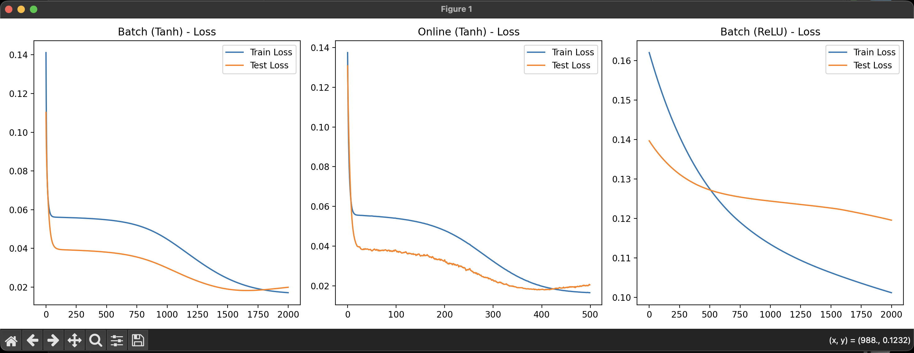

# Project 3 — Regression

Neural network regression model implemented from scratch using NumPy.

## Usage

```bash
python proj3.py
```

## Features

| Feature               | Notes                                                  |
|-----------------------|--------------------------------------------------------|
| Custom Neural Network | Implemented from scratch using NumPy                   |
| Activation functions  | Tanh, Sigmoid, ReLU (using Softplus derivative)        |
| Training modes        | Batch and Online (Stochastic)                          |
| Evaluation            | Train vs Test loss analysis (overfitting/underfitting) |

## How it works

Data is loaded from the `Dane` directory and split into training and test sets. A custom multi-layer perceptron (MLP) is
trained using backpropagation. The model evaluates different activation functions and training methods (batch vs.
online). Loss curves are plotted to assess model performance and fitting.

## Outputs



```text
Found 16 dataset files. Randomly selected: Dane/dane9.txt
Successfully loaded data from Dane/dane9.txt
Total samples: 50
Training samples: 40
Testing samples:  10

--- Starting Batch Training | Activation: TANH | Epochs: 2000 ---
Epoch    1/2000 -> Train MSE: 0.1411 | Test MSE: 0.1103
Epoch  500/2000 -> Train MSE: 0.0547 | Test MSE: 0.0380
Epoch 1000/2000 -> Train MSE: 0.0448 | Test MSE: 0.0299
Epoch 1500/2000 -> Train MSE: 0.0244 | Test MSE: 0.0189
Epoch 2000/2000 -> Train MSE: 0.0171 | Test MSE: 0.0199
Batch training complete.

--- Starting Online Training | Activation: TANH | Epochs: 500 ---
Epoch    1/500 -> Train MSE: 0.1374 | Test MSE: 0.1308
Epoch  125/500 -> Train MSE: 0.0532 | Test MSE: 0.0361
Epoch  250/500 -> Train MSE: 0.0412 | Test MSE: 0.0282
Epoch  375/500 -> Train MSE: 0.0220 | Test MSE: 0.0185
Epoch  500/500 -> Train MSE: 0.0166 | Test MSE: 0.0205
Online training complete.

--- Starting Batch Training | Activation: RELU | Epochs: 2000 ---
Epoch    1/2000 -> Train MSE: 0.1621 | Test MSE: 0.1397
Epoch  500/2000 -> Train MSE: 0.1275 | Test MSE: 0.1273
Epoch 1000/2000 -> Train MSE: 0.1135 | Test MSE: 0.1244
Epoch 1500/2000 -> Train MSE: 0.1063 | Test MSE: 0.1227
Epoch 2000/2000 -> Train MSE: 0.1012 | Test MSE: 0.1196
Batch training complete.

Rendering loss evaluation plots...
```