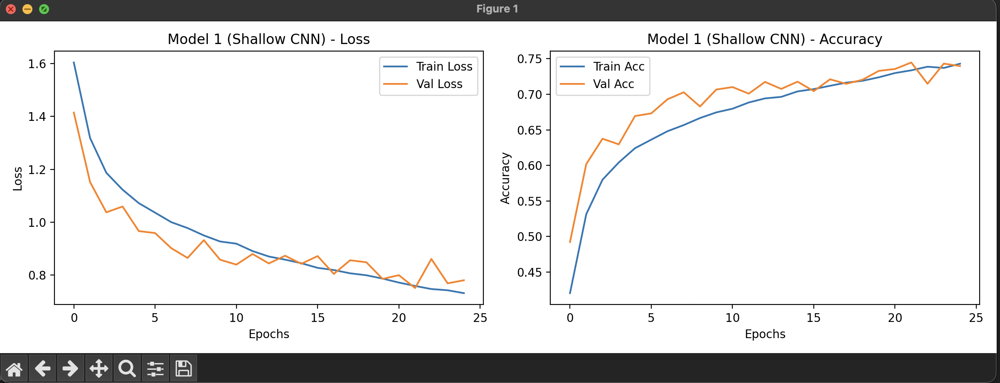
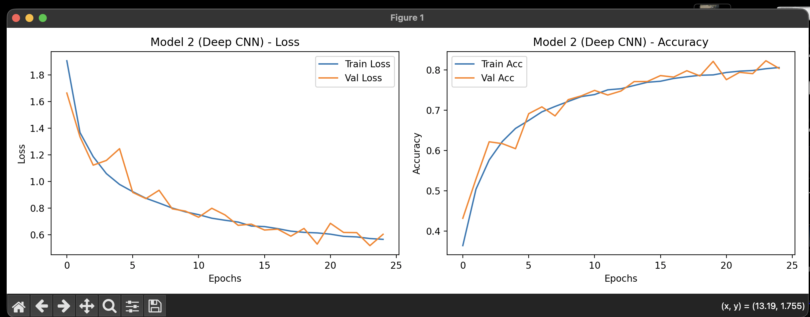
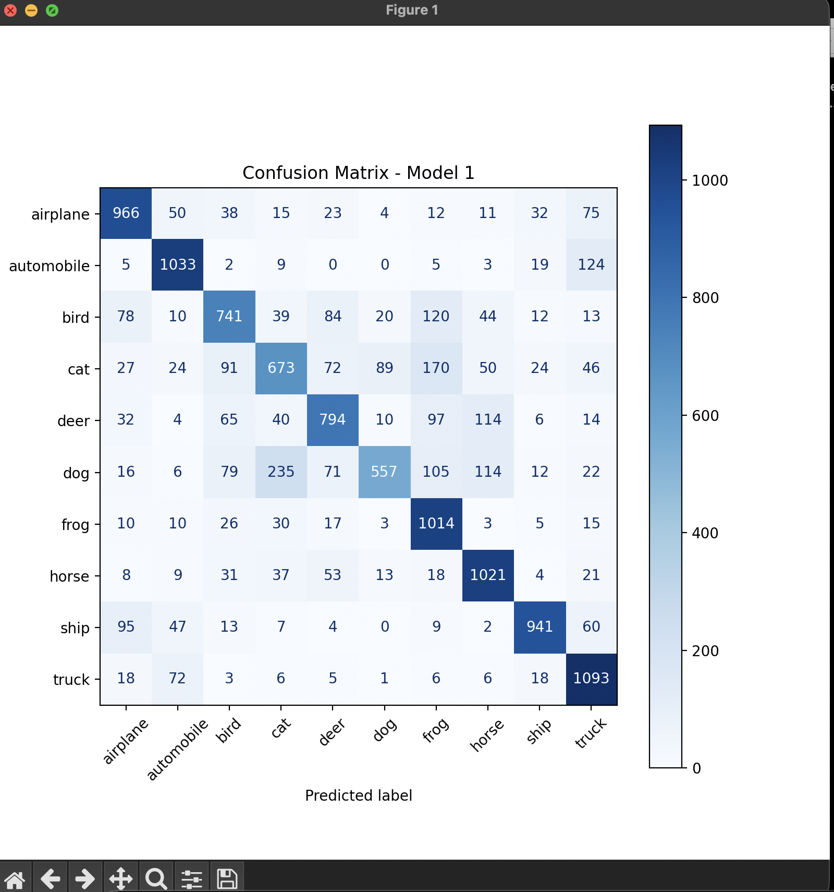
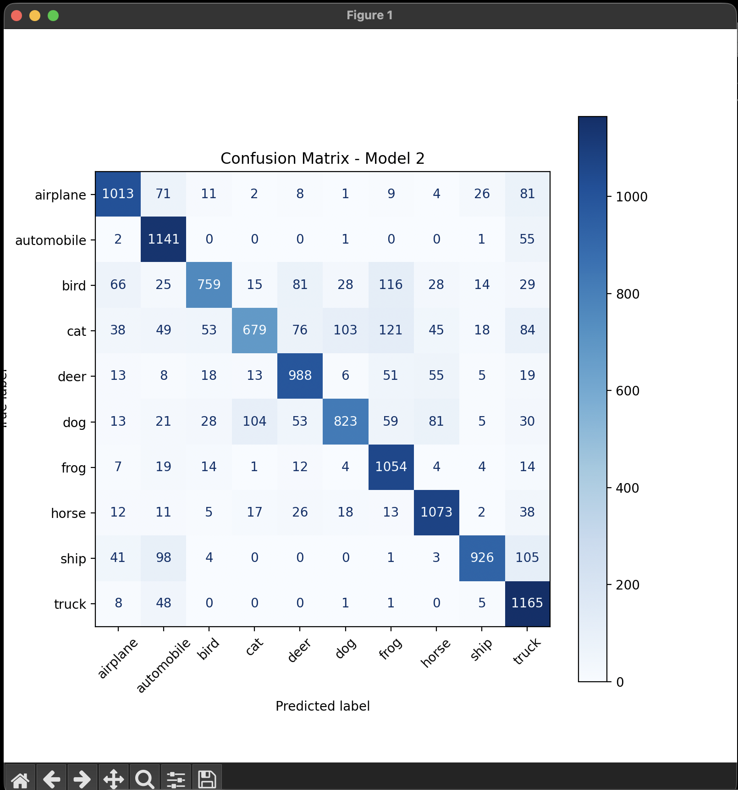

# Project 4 — Convolutional Neural Networks

CNN models implemented to classify images from the CIFAR-10 dataset using Keras/TensorFlow.

## Usage

```bash
pip install numpy matplotlib scikit-learn tensorflow
python proj4.py
```

## Features

| Feature           | Notes                                                                        |
|-------------------|------------------------------------------------------------------------------|
| Dataset           | CIFAR-10 combined and split into 60/20/20 (Train/Validation/Test)            |
| Preprocessing     | Pixel normalization [0, 1] and One-Hot Encoding                              |
| Data Augmentation | Rotations, shifts, and horizontal flips to prevent overfitting               |
| Architectures     | Model 1 (Shallow CNN), Model 2 (Deep CNN with Batch Normalization & Dropout) |
| Evaluation        | Training history plotting, Confusion Matrices, Overfitting Analysis          |

## How it works

The CIFAR-10 dataset is loaded and split into a 60% training, 20% validation, and 20% testing sets. Data augmentation is
applied dynamically to the training set using `ImageDataGenerator`. Two CNN models are built and trained: a standard
shallow CNN and a deeper VGG-style CNN. The deep network utilizes Batch Normalization and Dropout layers to achieve over
80% accuracy. Finally, learning curves (loss and accuracy) and confusion matrices are generated to analyze
misclassifications and diagnose underfitting or overfitting.

## Output






```txt
--- Test Set Evaluation ---
Model 1 Test Accuracy: 0.7361
Model 2 Test Accuracy: 0.8018

==================================================
ANALYSIS AND CONCLUSIONS
==================================================
1. Overfitting/Underfitting Analysis:
   - Model 1 (Shallow): Typically starts overfitting early. You can observe the validation loss diverging from the training loss.
   - Model 2 (Deep): Utilizing Data Augmentation, Dropout, and Batch Normalization keeps the validation curves much closer to the training curves, drastically reducing overfitting.

2. Misclassifications Analysis:
   - In the plotted Confusion Matrices, you will notice certain classes are frequently confused.
   - For example, 'Cats' and 'Dogs' are heavily misclassified as each other due to structural similarities.
   - 'Automobile' and 'Truck' also share misclassifications, while classes with distinct backgrounds like 'Airplane' and 'Ship' have higher accuracy.

3. Best Model Choice:
   - Model 2 is superior. The spatial hierarchy captures more complex traits, while regularization techniques (Dropout/BN) ensure it generalizes well to unseen test data.
==================================================
```