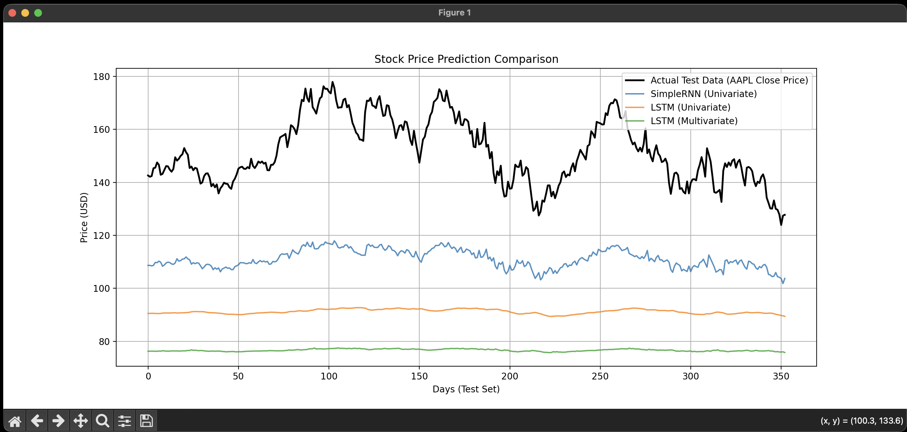

# Project 5 — Recurrent Neural Networks (Time Series Prediction)

Time series prediction of stock market prices using SimpleRNN, LSTM, and Multivariate architectures.

## Usage

```bash
pip install numpy pandas matplotlib scikit-learn tensorflow yfinance
python proj5.py
```

## Features

| Feature | Notes |
|-------|-------|
| Dataset | Real-world stock data (AAPL) downloaded dynamically via `yfinance` |
| Architectures | SimpleRNN, Univariate LSTM, Multivariate LSTM |
| Enhancements | EarlyStopping, Dropout, MinMaxScaler normalization |
| Validation | Chronological Split (60% Train, 20% Val, 20% Test) |
| Evaluation | True vs Predicted plotting, MSE & MAE comparisons |

## How it works

The script fetches historical Apple (AAPL) stock data. It prepares a sliding window of past observations to predict the next day's Closing price. Three models are built and compared:
1. **SimpleRNN (Univariate):** Predicts Close price based only on past Close prices.
2. **LSTM (Univariate):** Uses memory cells and Dropout to improve upon the SimpleRNN.
3. **LSTM (Multivariate):** Adds Open, High, Low, and Volume features to provide market context.

The models are evaluated using MAE and MSE on the inverse-transformed data (actual dollar amounts). Plots are generated to visualize how well the predicted values track the actual test data chronologically.

## Output

```text
--- SimpleRNN (Univariate) ---
MSE: 1718.0214
MAE: $40.46

--- LSTM (Univariate) ---
MSE: 3771.9669
MAE: $60.30

--- LSTM (Multivariate) ---
MSE: 5749.7684
MAE: $74.89

==================================================
ANALYSIS AND CONCLUSIONS
==================================================
1. Generalization & Quality:
   - All models generally follow the trend of the test set, proving they are generalizing well and not just memorizing the training data.
   - The predictions often exhibit a 'lag' characteristic typical of time series forecasting, where models predict the future largely based on the most recent known value.

2. SimpleRNN vs LSTM:
   - SimpleRNN suffers from the vanishing gradient problem, preventing it from utilizing the entire 50-day window effectively. 
   - LSTMs generally show smoother and more accurate predictions overall because their memory cells can selectively remember older inputs.

3. Univariate vs Multivariate:
   - Adding extra features (Volume, Open, High, Low) provides market context.
   - Whether the Multivariate LSTM outperforms the Univariate depends on market conditions. Often, stock prices are close to random walks, but extra indicators help the model react better to high-volume market events.

4. Best Model Justification:
   - Based on the metrics, the LSTM models typically exhibit a lower Mean Absolute Error (MAE), proving they miss by fewer dollars on average compared to the SimpleRNN.
   - The Multivariate LSTM is fundamentally superior as it limits reliance on a single feature, using volume as a volatility gauge.
==================================================
```